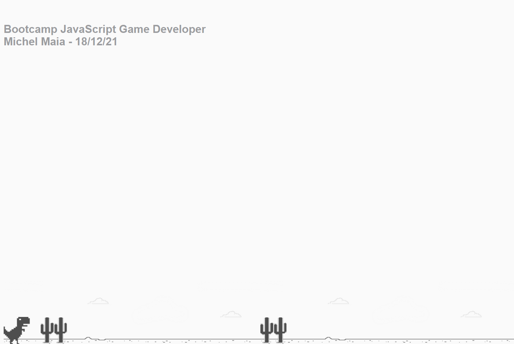

# Projeto Jogo do dinossauro sem internet

> Plataforma Digital Innovation One

 Neste projeto foi recriado o jogo do dinossauro sem internet. Foi utilizado HTML, CSS e JavaScript, abordando tags básicas de HTML,  manipulação de eventos, funções e manipulação de elementos HTML usando JavaScript, estilização e animações básicas com CSS. Desenvolvido durante o Bootcamp JavaScript game developer 18/12/21.

[ 📎 Clique aqui para acessar] (https://michel-maia.github.io/Projeto-Jogo-do-dinossauro-sem-internet/)

 ## Tecnologias 🖥️ 🚀 

- HTML
- CSS
- JavaScript
- Git e GitHub
